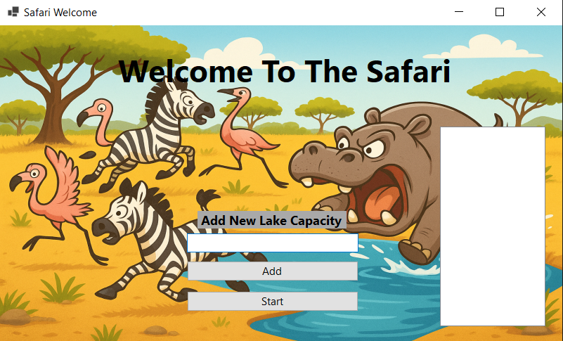

# Safari  

This project simulates a safari environment with multiple lakes, where different types of animals (Flamingos, Zebras, Hippos) compete for access to water resources. The simulation uses multithreading and synchronization to model real-world constraints and animal behaviors.

## Features

- **Dynamic Lake Creation:** Users can specify the number and capacity of lakes.
- **Animal Simulation:** Flamingos, Zebras, and Hippos each have unique behaviors and requirements for drinking.
- **Threaded Animal Logic:** Each animal is managed by its own thread, simulating concurrent access to lakes.
- **Resource Management:** Lakes enforce capacity and special rules (e.g., Hippos require exclusive access).
- **WinForms UI:** Visual representation of lakes and animal activity.

## Project Structure

- MainForm.cs / WelcomeForm.cs: Windows Forms UI for user interaction and visualization.
- Safari.cs: Main simulation logic, manages lakes and animal threads.
- `Access Managers/`: Contains resource management logic (LakeManager.cs, WaterResourceManager.cs).
- Animals: Animal thread classes for each animal type.
- WaterResource: Lake and water resource abstractions.
- Resources: Contains images (e.g., `lake.png`) and other assets.

## How to Run

1. **Open the Solution:** Open Safari.sln in Visual Studio.
2. **Build the Project:** Build the solution to restore dependencies and compile the code.
3. **Run:** Start the application. Use the Welcome screen to add lakes and set their capacities, then start the simulation.
4. **App Home Page**:  

5. **Insert parameters**:  

6. **Safari Game**:  

## Usage

- **Add Lakes:** Enter a capacity and click "Add" to create new lakes.
- **Start Simulation:** Click "Start" to launch the main simulation window.
- **Observe:** Watch as animals attempt to drink from the lakes, following the rules for access and capacity.

## Key Classes

- `Safari1`: Manages the overall simulation and animal generation.
- [`LakeManager`](Access Managers/LakeManager.cs): Handles synchronization and access rules for each lake.
- `AnimalsThread`: Base class for animal threads.
- `Lake`: Represents a single lake resource.

## Requirements

- .NET 8.0 or later
- Windows OS (uses Windows Forms)
